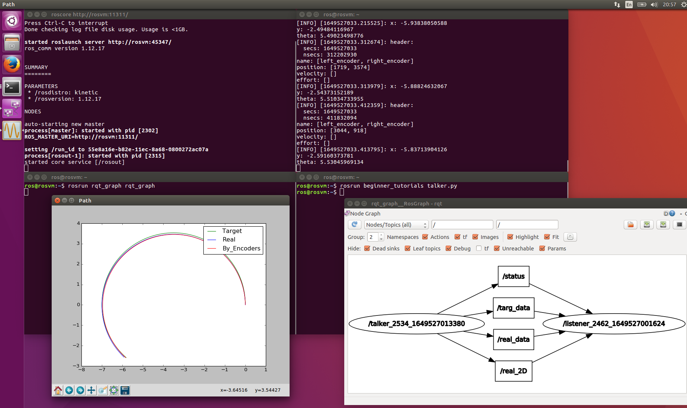

# Симулятор движения робота (ROS)
## Работает на Linux и Python
## Содержит два файла (узла):
* [Издатель - talker.py](#1)
* [Подписчик - listener.py](#2)

## Узел-издатель talker.py
### Как пользоваться
Перед работой запустите roscore ($ roscore).  
Для запуска введите команду  
$ rosrun beginner_tutorials talker.py  
где beginner_tutorials - имя каталога, в котором лежат папки с исходными кодами.   
Чтобы симуляция работала верно, запускайте после запуска подписчика!
### Что делает
Производит расчёт параметров симуляции.  
Передаёт текущие линейную и угловую скорости робота подписчику.  

## Узел-подписчик listener.py
### Как пользоваться
Перед работой запустите roscore ($ roscore).  
Для запуска введите команду  
$ rosrun beginner_tutorials listener.py  
где beginner_tutorials - имя каталога, в котором лежат папки с исходными кодами.  
Чтобы симуляция работала верно, запускайте перед запуском издателя!
### Что делает
Производит расчёт параметров симуляции.  
Принимает от издателя текущие линейную и угловую скорости робота.  
Публикует реальные координаты робота и показания энкодеров.  
По принятым и расчитанным данным строит графики траекторий движения робота.  
## Как это выглядит

